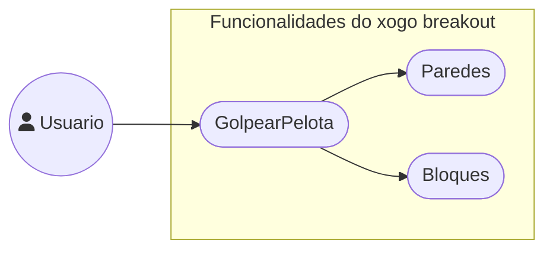

# Análise: Requirimentos do sistema

## Descrición xeral

## Casos de uso

## Funcionalidades

### FUNCIONAIS

- Añadir funcionalidades novas e melloradas ao xogo breakout.
- Correción de bugs.

### NON FUNCIONAIS

- Soporte para diferentes resolucións de pantalla.
- Soporte para diferentes idiomas.

## Tipos de usuarios

- Usuario: pode interactuar usando a pa coa pelota do xogo
