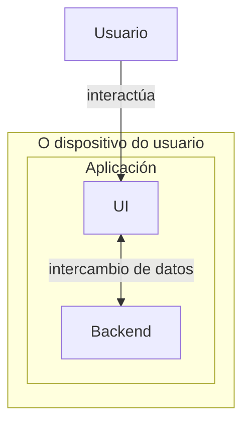
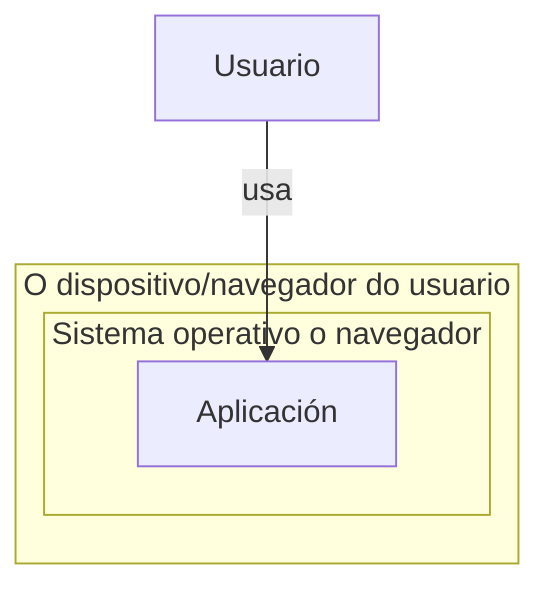

# Deseño

## Diagrama da arquitectura

### Diagrama de componentes

### Diagrama de Despregamento

## Diagrama de Base de Datos

Non aplica non existe un almacenado da puntuación máis alta acadada

## Diagrama de clases

Non aplica, non hai clases definidas no proxecto

## Deseño da interface de usuario

Intentar ser parecido ao breakout orixinal.