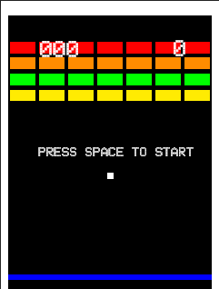
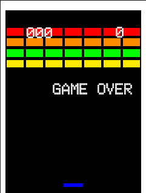

# Manual de usuario

## Escenario
El escenario de la aplicación es el siguiente:
- El rectangulo azul es la paleta que tiene el jugador para golpear la pelota.
- El cuadrado blanco debajo del texto es la pelota
- Los rectángulos de colores son los bloques que hay que destruir con la pelota. Cada uno suma una puntuación propia en función del color/tipo de bloque.
- Las vidas del jugador es el valor númerico de la derecha.
- La puntuación acumulada del jugador es el valor númerico de la izquierda

## Sin vidas
Cuando te quedas sin vidas, aparece la siguiente pantalla:
Puedes reiniciar el juego pulsando cualquier tecla

## Menu pausa
Este menu como tal no existe en el juego, pero se puede abandonar el mismo pulsando la tecla ESC.